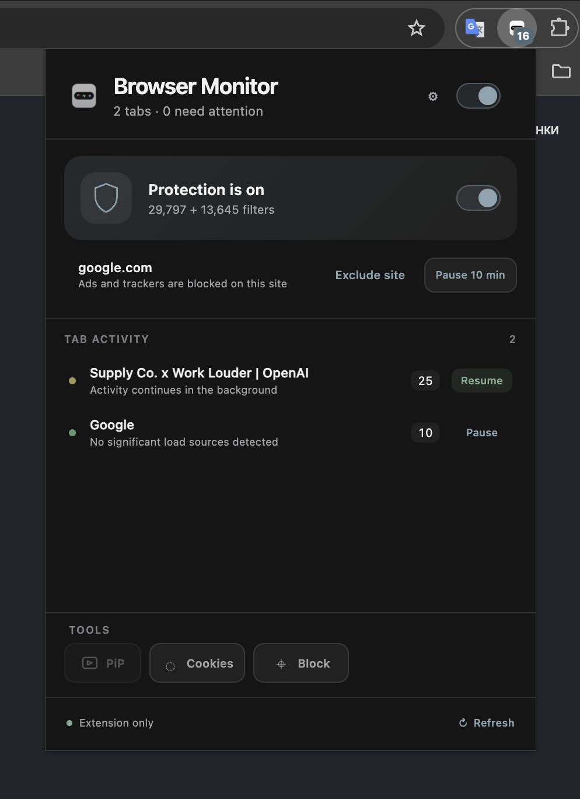
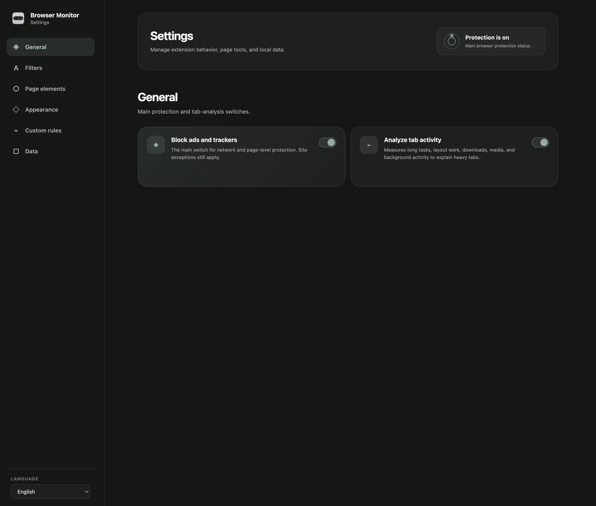
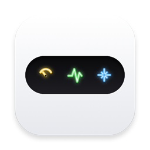

  

<h1 align="center">Browser Monitor</h1>

  
  
  
  

Browser Monitor is a local-first Chrome extension that combines content protection with clear tab activity insights. It works inside Chrome without an account, advertising SDK, or developer-operated analytics server.

## What it does

- blocks common ads, trackers, and cryptomining requests with Chrome Declarative Net Request;
- explains which open tabs stay active and why they may need attention;
- pauses expensive tab activity through reversible Eco Mode controls;
- hides supported cookie banners, newsletter prompts, surveys, notification prompts, autoplay, and floating video;
- provides site exceptions, custom filters, an element picker, Image Swap, Picture-in-Picture, and optional cookie export;
- includes separate English and Russian settings.

  

## Install

1. Open `chrome://extensions` and enable **Developer mode**.
2. Select **Load unpacked**.
3. Choose the `Extension` folder from this repository.
4. Pin Browser Monitor to the Chrome toolbar.

All tab measurements and settings remain in the local Chrome profile. Cookies, downloads, and clipboard access are requested only when the related tool is used. See the [privacy policy](./docs/PrivacyPolicy.md) for details.

## Companion to MacCleaner

<table>
  <tr>
    <td width="92" align="center">
      
    </td>
    <td>
      <strong>Browser Monitor complements MacCleaner.</strong> 
      MacCleaner shows system-wide load on macOS, while Browser Monitor explains activity inside individual Chrome tabs and provides browser-level protection tools. 
      <a href="https://github.com/Jas952/MacCleaner">github.com/Jas952/MacCleaner</a>
    </td>
  </tr>
</table>

## Contact

  

<pre hspace="12">
   Telegram ······ <a href="https://t.me/Jas953/">t.me/Jas953</a>
   LinkedIn ······ <a href="https://www.linkedin.com/in/jas952/">linkedin.com/in/jas952</a>
   X        ······ <a href="https://x.com/not__jas">x.com/not__jas</a>
</pre>
 
