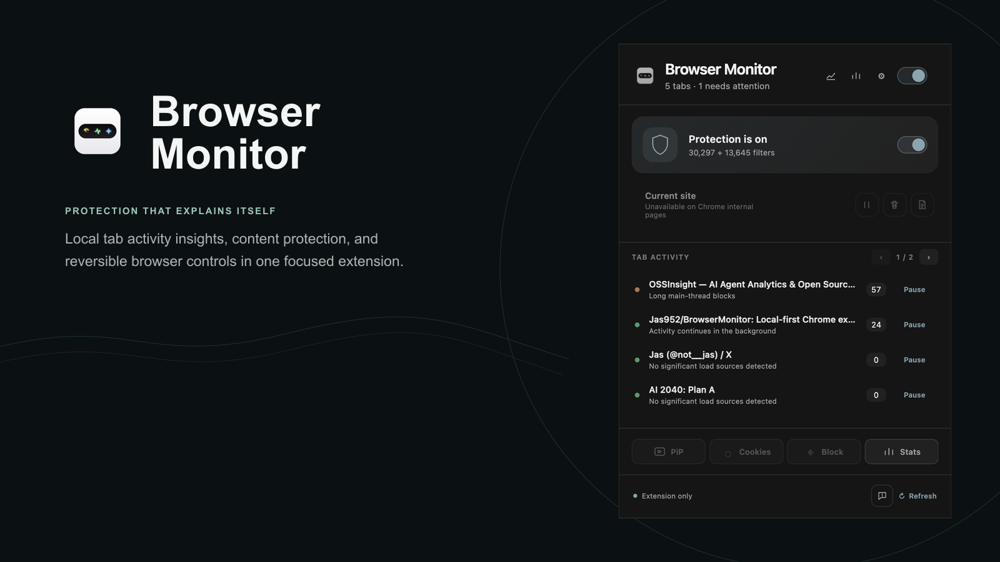
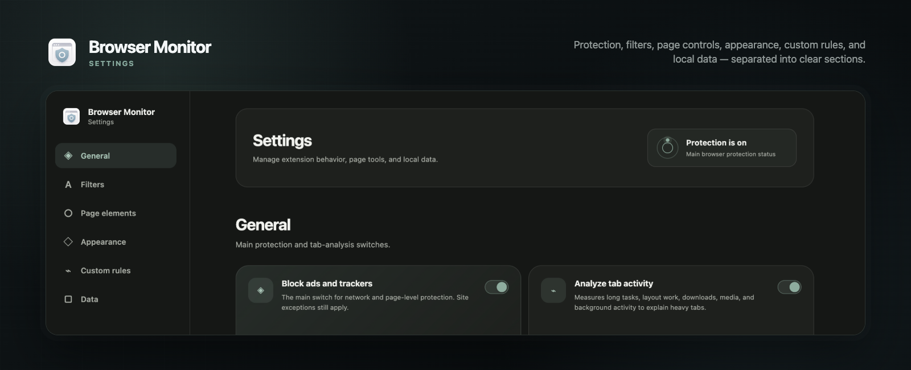
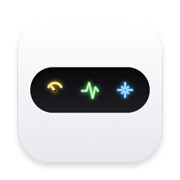

<p align="center">
  
</p>

<h1 align="center">Browser Monitor</h1>

<p align="center">
  
  
  
  
  
</p>

<p align="center">
  <a href="https://chromewebstore.google.com/detail/browser-monitor/fgpfbdfacppnhcmjkgnknjhahngealoa">
    
  </a>
  <a href="https://github.com/Jas952/BrowserMonitor/releases/latest">
    
  </a>
</p>

Browser Monitor is a local-first Chrome extension that combines content protection with clear tab activity insights. It works inside Chrome without an account, advertising SDK, or developer-operated analytics server.

## What it does

- blocks common ads, trackers, and cryptomining requests with Chrome Declarative Net Request;
- adds specialized YouTube/Rutube video-ad controls and optional SponsorBlock community segment skipping;
- warns before opening suspicious links with local checks for shorteners, lookalike domains, punycode, redirects, and risky social-feed destinations;
- labels risky search results on popular search engines and lets trusted domains be allowed locally;
- protects copied wallet addresses against invisible-character tricks and paste substitution attempts;
- remembers supported long-form videos and shows a local Continue Watching list in the popup;
- shows a local privacy receipt for the current site on demand;
- can hide selected domains from local Chrome history and supported search suggestions after explicit history permission;
- shows live local blocking statistics for today and a rolling seven-day window, including top sites and resources;
- measures active visits, reading, and video time only while a page is visibly in use;
- explains which open tabs stay active and why they may need attention;
- pauses expensive tab activity through reversible Eco Mode controls;
- hides supported cookie banners, newsletter prompts, surveys, notification prompts, autoplay, and floating video;
- provides site exceptions, custom filters, an element picker, Image Swap, Picture-in-Picture, and optional cookie export;
- sends site-filter reports and feature requests only after explicit confirmation;
- includes separate English and Russian settings.

<p align="center">
  
</p>

## Install

### Chrome extension

Install Browser Monitor directly from the [Chrome Web Store](https://chromewebstore.google.com/detail/browser-monitor/fgpfbdfacppnhcmjkgnknjhahngealoa), then pin it to the Chrome toolbar.

For manual installation or development:

1. Download `browser-monitor-1.1.3.zip` from the [latest release](https://github.com/Jas952/BrowserMonitor/releases/latest) and extract it.
2. Open `chrome://extensions` and enable **Developer mode**.
3. Select **Load unpacked** and choose the extracted folder containing `manifest.json`.

### macOS companion (optional)

1. Download `BrowserMonitor.dmg` from the [latest release](https://github.com/Jas952/BrowserMonitor/releases/latest).
2. Open the disk image and drag Browser Monitor to Applications.
3. Launch Browser Monitor to view the extension guide or choose an installation source.

The companion requires macOS 14 or later. Because the current DMG is not Developer ID notarized, macOS may require first-launch confirmation in **System Settings → Privacy & Security**.

All tab measurements and settings remain in the local Chrome profile. Cookies, downloads, and clipboard access are requested only when the related tool is used. See the [privacy policy](./docs/PrivacyPolicy.md) for details.

## Repository layout

| Path | Purpose |
| --- | --- |
| `Extension/` | Chrome Manifest V3 extension and its Node test suite. |
| `MacApp/` | Native macOS 14+ SwiftUI companion, resources, and Swift tests. |
| `cloudflare/feedback-worker/` | Optional feedback delivery service. It is deployed separately and is not included in the extension package. |
| `script/` | Maintained release, filter-list, and local macOS build tools. |
| `docs/` | Privacy policy, release guidance, product notes, and repository media. |

The Chrome Web Store upload is built from an explicit allowlist and contains only extension runtime files:

```bash
node script/build_release.mjs
```

For local verification:

```bash
npm --prefix Extension test
swift test --package-path MacApp
```

## Companion to MacCleaner

<table>
  <tr>
    <td width="92" align="center">
      
    </td>
    <td>
      <strong>Browser Monitor complements MacCleaner.</strong><br />
      MacCleaner shows system-wide load on macOS, while Browser Monitor explains activity inside individual Chrome tabs and provides browser-level protection tools.<br />
      <a href="https://github.com/Jas952/MacCleaner">github.com/Jas952/MacCleaner</a>
    </td>
  </tr>
</table>

## Contact

<pre hspace="12">
   Telegram ······ <a href="https://t.me/Jas953/">t.me/Jas953</a>
   LinkedIn ······ <a href="https://www.linkedin.com/in/jas952/">linkedin.com/in/jas952</a>
   X        ······ <a href="https://x.com/not__jas">x.com/not__jas</a>
</pre>
