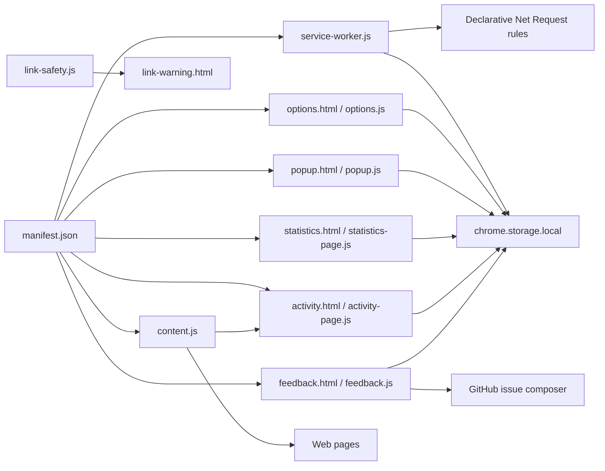

# Architecture

## Обзор

Browser Monitor - Chrome Manifest V3 extension без backend и bundler. Runtime находится в `Extension/`; корневой `README.md`, `docs/` и release-документы описывают установку, privacy и публикацию.



## Точки входа

- `Extension/manifest.json` задаёт Manifest V3, permissions, optional permissions, service worker, popup, options page, content script и web-accessible resources.
- `Extension/service-worker.js` является background entry point и координирует extension-level события.
- `Extension/content.js` запускается на `http://*/*` и `https://*/*` на `document_start`.
- `Extension/popup.html` и `Extension/popup.js` отвечают за toolbar popup: верхняя иконка открывает Site Activity, а компактная footer-иконка рядом с Refresh открывает feedback/site-filter report.
- `Extension/options.html` и `Extension/options.js` отвечают за основную страницу настроек.
- `Extension/statistics.html` и `Extension/statistics-page.js` отвечают за расширенную статистику.
- `Extension/activity.html`, `Extension/activity-page.js` и `Extension/activity.css` отвечают за отдельное окно аналитики посещений.
- `Extension/feedback.html`, `Extension/feedback.js` и `Extension/feedback.css` отвечают за двуязычную форму feature/bug/site-filter requests. Popup может передать в неё текущий URL и заголовок только по явному нажатию пользователя; перед открытием GitHub issue composer форма локально добавляет версию расширения, состояние защиты сайта и ключевых фильтров. Черновик и необязательный screenshot сохраняются в ограниченной локальной очереди.
- `Extension/link-warning.html`, `Extension/link-warning.js`, `Extension/link-warning.css` обслуживают interstitial предупреждение о ссылках.

## Permissions и данные

Обязательные permissions:

- `alarms`
- `contextMenus`
- `declarativeNetRequest`
- `favicon`
- `scripting`
- `storage`
- `tabs`
- `webRequest`

Optional permissions:

- `clipboardWrite`
- `cookies`
- `downloads`
- `history`

Host permissions покрывают `http://*/*` и `https://*/*`, потому что content controls и блокировка работают на посещаемых страницах.

Пользовательские настройки, statistics counters и локальное состояние должны храниться в Chrome profile, преимущественно через `chrome.storage.local`.

Content script отправляет короткий 15-секундный sample только когда документ видим, вкладка находится в фокусе и с последнего pointer/keyboard/scroll/touch-взаимодействия прошло не более 45 секунд. Первый подтверждённый sample после перехода считается активным посещением. Service worker повторно получает домен из `sender.url`, агрегирует дневные счётчики и хранит только домен, visits, active/video/reading seconds за 90 дней.

Видео учитывается только для видимого воспроизводящегося `<video>` достаточного размера и отбрасывается по ad-маркерам контейнеров. Чтение учитывается на странице с не менее 1200 символами в `article`, `main`, `[role=main]` или `body`, если нет активного content-video. Проверка объёма текста кэшируется на 30 секунд. Открытая фоновая или неиспользуемая вкладка время не увеличивает.

## Блокировка и фильтры

Network-блокировка использует Declarative Net Request rule resources:

- `rules/easylist-network.json`
- `rules/easyprivacy-network.json`
- `rules/ruadlist-network.json`

Дополнительные rule/filter helpers находятся в:

- `blocker.js`
- `blocker-metadata.js`
- `filter-parser.js`
- `rules/cryptomining-rules.js`
- cosmetic CSS-файлах в `rules/`

Происхождение внешних списков фиксируется в `Extension/rules/ATTRIBUTION.md`.

Контекстное меню service worker пересоздаётся через `removeAll()`: оно позволяет исключить текущий сайт из DNR/cosmetic protection, заблокировать элемент под правым кликом и управлять отдельными Link Safety/History действиями. Ручной element picker сохраняет правило в формате `domain##selector`; content script применяет такой selector только на указанном домене и его поддоменах.

Link Safety перехватывает только переходы за пределы текущего origin. Внутренние ссылки остаются под управлением сайта, чтобы не заменять SPA-навигацию полной загрузкой страницы и не задерживать динамические ленты.

## Ограничение runtime-нагрузки

Content script использует событийную модель с ограниченными fallback-проверками:

- общий `MutationObserver` запускает защитный скан только при появлении media/ad-кандидатов, а не при каждом изменении DOM;
- observers для page protection и history privacy отключаются в скрытых вкладках и восстанавливаются при возврате вкладки на экран;
- периодический video fallback применяется только для YouTube/Rutube, работает с увеличенным интервалом и в скрытой вкладке выполняется существенно реже;
- Eco Mode группирует частые DOM-события и повторно проверяет media/Web Animations с ограниченной частотой;
- события локальной статистики блокировок накапливаются короткими пакетами, чтобы не переписывать `chrome.storage.local` после каждого сетевого события.

Эти ограничения не отключают инструменты: при возврате вкладки выполняется актуализирующий скан, generic video-ad элементы продолжают обнаруживаться по DOM-событиям, а точные счётчики сохраняются в пакетной записи.

## UI и локализация

Popup, options, statistics и warning pages используют plain HTML/CSS/JavaScript. Общие тексты и языковые варианты находятся в `localization.js`.

Основные UI-файлы:

- `popup.html`, `popup.css`, `popup.js`
- `options.html`, `options.css`, `options.js`
- `statistics.html`, `statistics.css`, `statistics-page.js`
- `activity.html`, `activity.css`, `activity-page.js`, `activity-statistics.js`
- `feedback.html`, `feedback.css`, `feedback.js`
- `link-warning.html`, `link-warning.css`, `link-warning.js`

## Тесты

Тесты лежат в `Extension/tests/` и запускаются командой:

```bash
rtk npm --prefix Extension test
```

Покрытые области включают manifest, blocker/filter parsing, cookies, link safety, localization, scoring и statistics.

## Связанные материалы

- [[Product]]
- [[Features]]
- [[Decisions]]
- [[Opportunities]]
